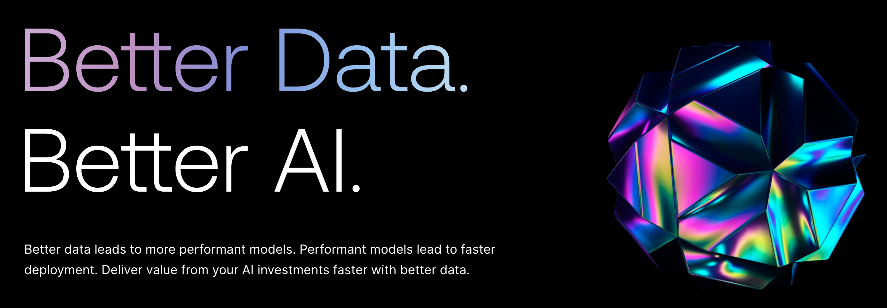
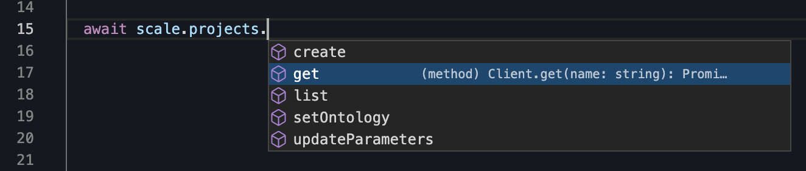
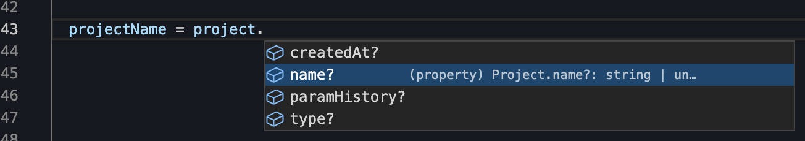
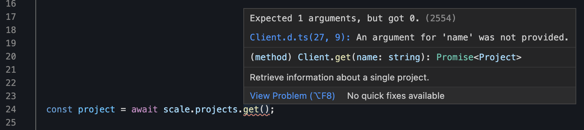

# Scale Node Library

[](https://www.npmjs.com/package/@fern-api/scale)

The Scale Node.js library provides access to the Scale API from JavaScript/TypeScript.

## Documentation

API reference documentation is available [here](https://docs.scale.com/reference/introduction).

## Installation

```
npm install @fern-api/scale
```

or

```
yarn add @fern-api/scale
```

## Usage

[](https://stackblitz.com/edit/typescript-example-using-sdk-built-with-fern-a9cuum?file=app.ts)

```typescript
import { ScaleClient } from '@fern-api/scale';

const scale = new ScaleClient({
  token: 'YOUR_API_KEY',
});

const batch = await scale.batches.create({
  project: 'project-id',
  name: 'My project',
});

console.log('Received response from Scale', response);
```

### Authentication

You can find your API keys on your [dashboard](https://scale.com/dashboard), which you can access by [logging in](https://scale.com/login) or [signing up](https://scale.com/signup).

When you constuct the `ScaleClient`, you can pass in your API key.

```typescript
import { ScaleClient } from '@fern-api/scale';

const scale = new ScaleClient({
  token: process.env.SCALE_API_KEY,
});
```

You can also pass a function:

```typescript
import { ScaleClient } from '@fern-api/scale';

const scale = new ScaleClient({
  token: getScaleApiKey,
});

function getScaleApiKey() {
  ...
}
```

### IDE integration

The Scale SDK is crafted to give you a great experience in your IDE. All types are nested
in the `Scale` export.

```typescript
import { ScaleClient, Scale } from '@fern-api/scale';

const scale = new ScaleClient({
  token: process.env.SCALE_API_KEY,
});

const batch: Scale.Batch = await scale.batches.create({
  project: 'project-id',
  name: 'My project',
});
```

You'll get autocomplete for methods:



and properties:



The SDK is fully typed. If you're using TypeScript, you'll get compiler errors if misuse the SDK:



### Error handling

When an error is encountered, a [`ScaleError`](src/errors/ScaleError.ts) is thrown. The error may contain
a `message` or a response `body`, which you can log to see additional information.

```typescript
import { ScaleClient, ScaleError } from '@fern-api/scale';

const scale = new ScaleClient({
  token: process.env.SCALE_API_KEY,
});

try {
  const batch = await scale.batches.create({
    project: 'project-id',
    name: 'My project',
  });
  ...
} catch (error) {
  if (error instanceof ScaleError) {
    console.error("Failed to create batch", error.message, error.body);
  } else {
    console.error(error);
  }
}
```

#### Timeouts

The Scale SDK will timeout after 60 seconds. When this happens, a [`ScaleTimeoutError`](src/errors/ScaleTimeoutError.ts)
is thrown:

```typescript
import { ScaleClient, ScaleTimeoutError } from '@fern-api/scale';

const scale = new ScaleClient({
  token: process.env.SCALE_API_KEY,
});

try {
  const batch = await scale.batches.create({
    project: 'project-id',
    name: 'My project',
  });
  ...
} catch (error) {
  if (error instanceof ScaleTimeoutError) {
    console.error("Timed out while trying to create batch.");
  } else {
    console.error(error);
  }
}
```

## Beta status

This SDK is in beta, and there may be breaking changes between versions without
a major version update. Therefore, we recommend pinning the package version to a
specific version in your package.json file. This way, you can install the same
version each time without breaking changes unless you are intentionally looking
for the latest version.

## Contributing

While we value open-source contributions to this SDK, this library is generated
programmatically. Additions made directly to this library would have to be moved
over to our generation code, otherwise they would be overwritten upon the next
generated release. Feel free to open a PR as a proof of concept, but know that
we will not be able to merge it as-is. We suggest [opening an
issue](https://github.com/fern-scale/scale-node/issues) first to discuss with
us!

On the other hand, contributions to the README are always very welcome!
